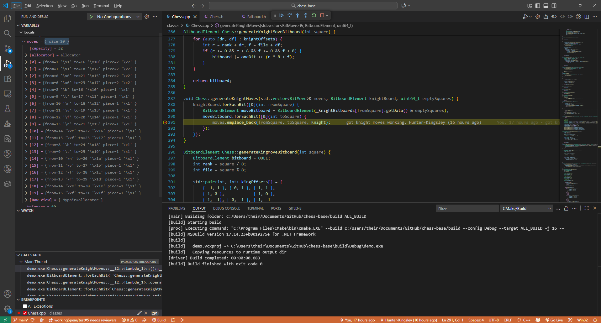

# Fen Strings
I implemented a simple algorithm to parse the FEN string by looping over it and either going a certain amount of squares forward, going to the next line, or placing the correct piece down depending on the character within the string

# Knight, Pawn, and King Movement
I used bitboards to create and track the possible moves for these pieces (as I will do with future pieces). The King and Knight use identical logic. I have an array to store the possible moves for each piece from all 64 squares and functions for each piece that add that piece's move offset and add all those possible move bitboards into the moves list

The pawns are less straightforward because black and white pawns do not move the same way from the same squares. To create the correct moves for each pawn, I have to create a total of 8 different bitboards (one for single moves, one for double moves based on if they did a single move from the starting position, one for both left and right captures, and then do all that twice for black and white pawns). After creating all those bitboards, I can take the shift needed to go from the pawn's starting position to all the possible places it's allowed to go and add those to the move list
